# 1 整体架构图
## 1.1 详细流程图

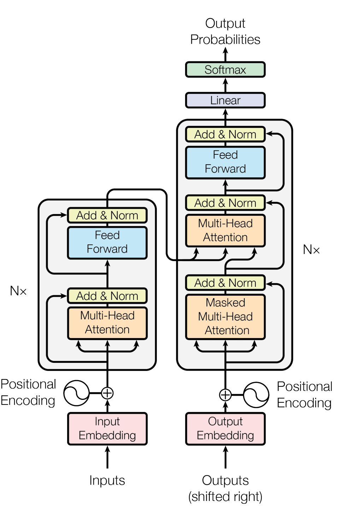

## 1.2 从整体上拆分

从整体上看，我们输入 transformer 一个句子，可以得到另一个句子。

对 transformer 内部拆分，可分为编码器和解码器两部分。编码器可以提取输入句子的特征，然后把提取的特征传给解码器，解码器可以根据特征解码出“输入句子的另一种语言的表达”

对编码器和解码器进行拆分：它们分别由多个子编码器和子解码器堆叠而成。通过堆叠，可以不断的编码和解码特征，使的可以提取更本质的特征或更加充分的理解特征。

对单个子编码器和解码器进行拆分。编码器由一个自注意力层和一个前馈层组成。解码器在自注意力层和前馈层之间还加了一个注意力层，用来帮助解码器关注输入句子的相关部分。

> [!NOTE]
> 解码器的第一个自注意力层提取了从解码器输入的特征，这个特征结合编码器传过来的特征，共同经过第二个注意力层，就可以融合来自编码器和解码器的输入。

# 2 编码器输入

第一个编码器的输入是由词嵌入和位置编码相加得到。

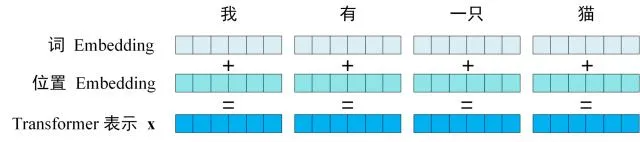

之后的编码器输入来自上一个编码器的输出。

## 2.1 位置编码

位置编码的计算公式如下：

$$ P E_{(p o s, 2 i)}=\sin \left(p o s / 10000^{2 i / d_{m o d e l}}\right) $$
$$ P E_{(\text {pos }, 2 i+1)}=\cos \left(\text { pos } / 10000^{2 i / d_{\text {model }}}\right) $$

# 3 自注意力层
## 3.1 注意力机制

假设我们有一个数学问题，想要知道它的答案，我们可以问三位老师：数学、物理、生物老师。三位老师分别从不同的学科角度给出了答案。我们要想获得最好的答案，必然是同时参考三位老师的回答，来生成最终的最优答案。但是我们不可能同等的重视三位老师的答案，因为数学问题那必然是数学老师给出的答案更值得参考。我们把我们的参考重点分布在不同的地方，这就是注意力机制。

为了从数学上计算注意力机制，我们引入三个概念：Q 、K 、V 。Q 相当于我们的问题，K 相当于老师所处的学科，V 相当于老师给出的答案。通过 Q 和 K 的相似度，我们可以知道我们应该怎么分配注意力，比如：数学老师占 60%、物理老师占 30%、生物老师占 10%。得到注意力分布情况后，对三位老师的答案进行加权求和，就得到了最优的答案。

公式如下：

$$ Attention(Q,K,V)=softmax(similarity(Q,K))\cdot V $$

## 3.2 自注意力机制

当 Q、K、V 都来自同一个事物时，我们称之为自注意。自注意主要用来计算这个事物中某个子元素和其他子元素之间的相关性。

比如在 transformer 中，自注意力机制用来计算输入句子中的某个单词和其他单词的相似性，然后加权求和，就得到了这个词在这个语境中的特征，这样就实现了动态词嵌入。

> [!NOTE]
> 自注意力机制也被称为缩放点积注意力机制

## 3.3 QKV 的计算

> [!NOTE]
> 计算的 QKV 矩阵的每一行对应于每一个单词的 qkv。但 QKV 的维度，也就是列数，不一定等于输出的维度。但在 transformer 中，QKV 的维度一样
> 

## 3.4 自注意力计算

计算图如下：

计算公式如下：

$$ Attention(Q,K,V)=Softmax(\frac{Q\cdot K^T}{\sqrt{d_{k}}})\cdot V $$

$\sqrt{d_{k}}$中的$d_k$ 表示 $QK$ 的维度。除以$\sqrt{d_{k}}$可以减少 $QK$ 维度对计算结果的影响

$Q\cdot K^T$ 计算的结果是一个方阵，维度是单词的个数，这个方阵就表示了单词和单词之间的相关度。假如输入矩阵维度为 4，则计算过程如下：

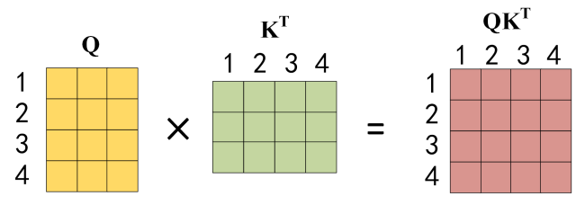

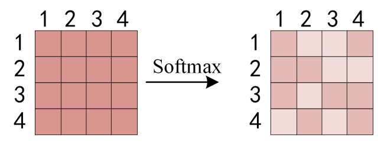

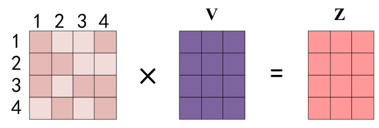

得到的$Z$就是参考了其他词特征整合而成的新的特征矩阵，也就是提取了语境信息。

## 3.5 多头注意力

上面介绍的是一个自注意力的计算，同时计算多个自注意力，就是多头自注意力。多个注意力可以从多方面提取特征，类比卷积神经网络中的多卷积核。

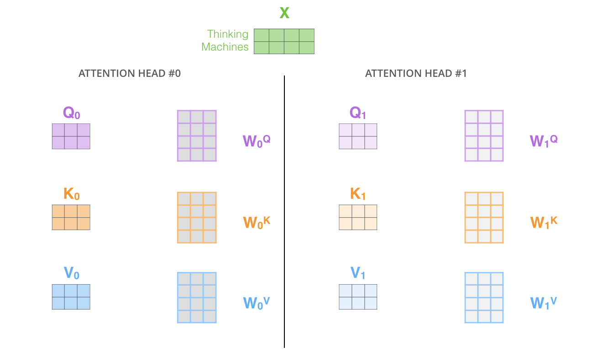

通过多个自注意力计算，可得到多个输出。这就是多头自注意力机制。

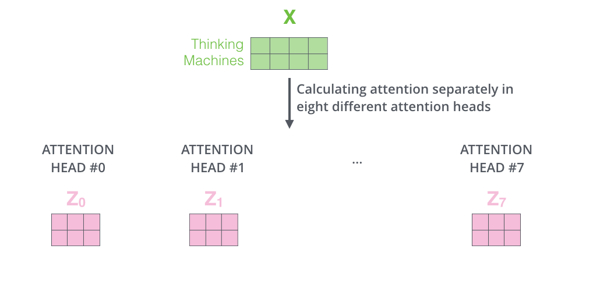

将得到的多个输出矩阵进行拼接，乘以一个权重矩阵，就得到了一个和输入矩阵维度一样的输出矩阵。

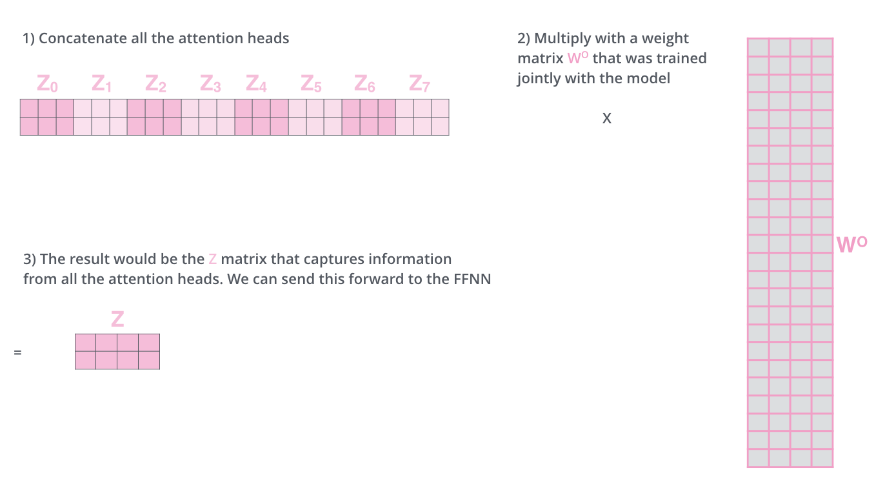

# 4 残差和规范化层

这一层对计算得到的自注意力矩阵$Z$加上原始的输入 $X$，并进行规范化，然后继续输出。

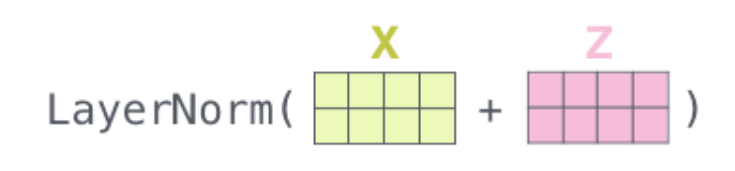

# 5 前馈全连接层

Feed Forward 层比较简单，是一个两层的全连接层，第一层的激活函数为 Relu，第二层不使用激活函数，对应的公式如下。

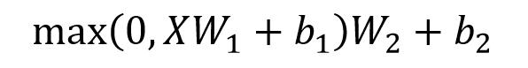

这一层输出的矩阵和输入的矩阵维度一致。

# 6 组成编码器模块

把上面介绍的层进行组装，即可得到一个编码器模块：

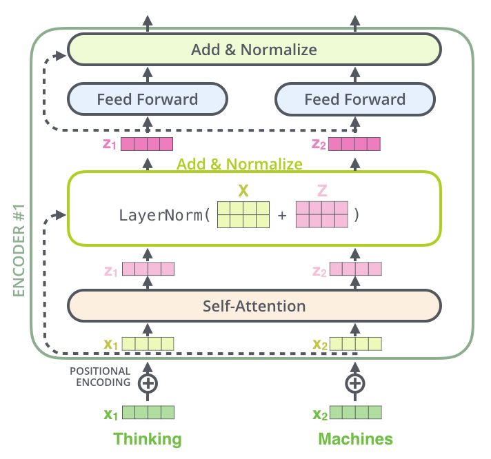

堆叠多个编码器模块，就得到了一个大的编码器。

> [!NOTE]
> 上图中的$X_1、X_2$是把矩阵按行拆分后的形式，它们组合起来就是一个输入矩阵$X$。

# 7 解码器
## 7.1 整体流程

解码器的基本结构和编码器相比，就两个自注意力层有点差异，其他的残差、规范化、前馈全连接和编码器一样。

> [!NOTE]
> 解码器部分的计算是按时间步进行的。

## 7.2 第一个自注意力层

第一个自注意力层的输入是带掩码的输入，这样可以防止前面的词知道后面词的信息。

## 7.3 第二个注意力层

第二个注意力层的 K 和 V 由编码器的输出的计算得到，而 Q 由解码器的第一个注意力层的输出计算得到。

# 8 最后的线性层和 Softmax 层

最后要实现预测下一个词的功能，还需要一个线性层再加上一个 Softmax 层。

# 9 参考资料

- [Transformer模型详解（图解最完整版）](https://zhuanlan.zhihu.com/p/338817680)
- [【精选】Transformer 模型详解_空杯的境界的博客-CSDN博客](https://blog.csdn.net/benzhujie1245com/article/details/117173090)
- [Transformer各层网络结构详解！面试必备！(附代码实现) - mantch - 博客园](https://www.cnblogs.com/mantch/p/11591937.html)
- https://jalammar.github.io/illustrated-transformer/

