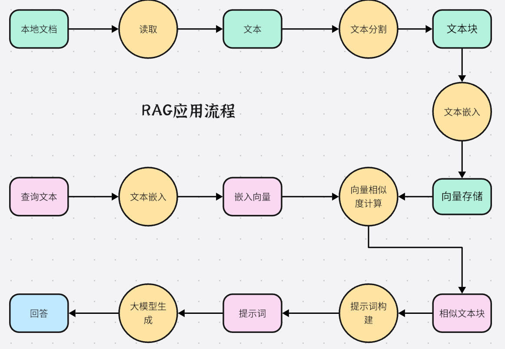

# 向量

## 向量和标量

向量和标量是数学和物理学中两个重要的概念，以下是对它们的详细解释：

### 标量
- **定义**：标量是只有大小，没有方向的量。在物理学中，标量通常用来描述物体的一些基本属性，如质量、温度、时间、路程、能量等。
- **运算**：标量的运算遵循基本的代数运算法则，如加法、减法、乘法和除法。例如，两个质量分别为$m_1 = 3kg$和$m_2 = 5kg$的物体，它们的总质量$m = m_1 + m_2 = 3kg + 5kg = 8kg$。

### 向量
- **定义**：向量是既有大小又有方向的量。在物理学和工程学中，很多物理量都是向量，如位移、速度、加速度、力、电场强度等。
- **表示方法**：向量可以用多种方式表示。
    - **几何表示**：用有向线段来表示，有向线段的长度表示向量的大小，箭头所指的方向表示向量的方向。
    - **字母表示**：通常用小写字母上面加一个箭头来表示向量，如$\vec{a}$、$\vec{b}$等；在印刷体中，也常用黑体字母来表示向量，如**a**、**b**。
- **向量的大小**：也称为向量的模，记作$\vert\vec{a}\vert$。如果向量$\vec{a}=(x,y)$，那么它的模$\vert\vec{a}\vert=\sqrt{x^{2}+y^{2}}$。
- **运算**
    - **加法**：向量加法遵循平行四边形法则或三角形法则。若有向量$\vec{a}$和$\vec{b}$，以这两个向量为邻边作平行四边形，那么从公共起点出发的对角线所表示的向量就是$\vec{a}+\vec{b}$；三角形法则是将向量$\vec{b}$的起点与向量$\vec{a}$的终点相连，那么从$\vec{a}$的起点到$\vec{b}$的终点的向量就是$\vec{a}+\vec{b}$。
    - **减法**：向量减法是加法的逆运算，$\vec{a}-\vec{b}=\vec{a}+(-\vec{b})$，即减去一个向量等于加上这个向量的相反向量。
    - **数乘**：实数$\lambda$与向量$\vec{a}$的乘积是一个向量，记作$\lambda\vec{a}$。当$\lambda>0$时，$\lambda\vec{a}$与$\vec{a}$方向相同，且$\vert\lambda\vec{a}\vert=\lambda\vert\vec{a}\vert$；当$\lambda<0$时，$\lambda\vec{a}$与$\vec{a}$方向相反；当$\lambda = 0$时，$\lambda\vec{a}=\vec{0}$。

## 向量的维度

向量的维度是指向量中元素的个数，它是描述向量空间特性的一个重要概念。

### 定义与表示
- 在数学中，一个$n$维向量可以表示为$\vec{v}=(v_1,v_2,\cdots,v_n)$，其中$v_1,v_2,\cdots,v_n$是向量的元素，$n$就是向量的维度。例如，$\vec{a}=(1,2,3)$是一个三维向量，$\vec{b}=(4,5,6,7)$是一个四维向量。

### 向量空间与维度
- 向量空间是由向量组成的集合，并且满足一定的运算规则（如加法和数乘封闭）。向量空间的维度是指其基向量的个数。基是向量空间中的一组线性无关向量，它们可以张成整个向量空间。例如，在三维欧几里得空间$\mathbb{R}^3$中，常见的基是$\vec{e_1}=(1,0,0)$，$\vec{e_2}=(0,1,0)$，$\vec{e_3}=(0,0,1)$，任何一个三维向量都可以表示为这三个基向量的线性组合，所以$\mathbb{R}^3$的维度是$3$。

### 维度的作用
- **数据表示与特征提取**：在机器学习和数据分析中，向量的维度常常对应着数据的特征数量。例如，在分析学生的考试成绩时，若考虑语文、数学、英语、物理、化学这五门课程的成绩，那么每个学生的成绩就可以用一个五维向量来表示，每个维度分别对应一门课程的成绩。通过对这些高维向量数据的分析，可以提取出有价值的信息，如学生的成绩分布、学科之间的相关性等。
- **模型复杂度与计算量**：在深度学习等领域，模型中向量的维度会影响模型的复杂度和计算量。一般来说，维度越高，模型能够表示的函数就越复杂，可能拟合的数据就越精确，但同时也会带来更大的计算量和内存消耗，以及更高的过拟合风险。例如，在神经网络中，如果输入向量的维度很高，那么连接输入层和隐藏层的权重矩阵的规模就会很大，训练过程中需要计算和更新的参数也就越多。

### 维度变换
- 在实际应用中，经常需要对向量的维度进行变换。例如，在数据预处理阶段，可能会通过主成分分析（PCA）等方法对高维数据进行降维，去除数据中的冗余信息，降低模型的复杂度和计算成本。相反，在一些生成模型中，可能会通过一些映射操作将低维向量扩展到高维空间，以生成更复杂的样本。例如，生成对抗网络（GAN）中的生成器就会将一个低维的随机向量映射到高维的数据空间，生成图像、文本等复杂的样本。

## 向量在深度学习中的应用

### 数据表示
- **特征向量**：深度学习中，输入数据通常被表示为向量。例如，在图像识别中，一张图像可以被转化为一个特征向量。可以将图像的每个像素值作为向量的一个元素，或者通过一些特征提取方法，如卷积神经网络（CNN）中的卷积层和池化层，提取出更具代表性的特征，组成特征向量。在自然语言处理中，单词或句子也可以用向量来表示，如词向量模型Word2Vec、GloVe等将单词映射到低维向量空间，使语义相似的单词在向量空间中距离较近。句子则可以通过对单词向量进行组合或使用更复杂的模型如循环神经网络（RNN）、长短时记忆网络（LSTM）等得到句子向量。

### 模型参数
- **权重向量**：深度学习模型中的参数，如神经网络中的权重，通常被表示为向量。每个神经元的权重向量决定了该神经元对输入数据的响应方式。在训练过程中，通过调整权重向量的值，使得模型能够最小化损失函数，从而实现对数据的准确拟合和预测。例如，在一个简单的全连接神经网络中，连接输入层和隐藏层的权重可以表示为一个二维矩阵，其中每一行就是一个权重向量，对应一个隐藏神经元与所有输入神经元之间的连接权重。

### 模型运算
- **向量运算**：深度学习中的各种运算大多基于向量运算。例如，在神经网络的前向传播过程中，输入向量与权重向量进行矩阵乘法运算，再加上偏置向量，经过激活函数得到输出向量。在反向传播过程中，通过计算损失函数对权重向量的梯度，利用梯度下降等优化算法更新权重向量。这些向量运算可以利用现代计算机的并行计算能力，如图形处理单元（GPU）来高效实现，大大提高了深度学习模型的训练和推理速度。

### 模型评估
- **评估指标向量**：在评估深度学习模型的性能时，会使用一些指标向量来全面衡量模型的表现。例如，在多分类问题中，常用的混淆矩阵就是一个二维向量矩阵，它可以帮助分析模型在各个类别上的预测准确性。此外，准确率、召回率、F1值等指标也可以组成一个向量，用于综合评估模型在不同方面的性能。通过对这些评估指标向量的分析，能够了解模型的优势和不足，从而有针对性地进行改进和优化。

### 生成对抗网络（GAN）
- **潜在向量**：在生成对抗网络中，潜在向量起着关键作用。生成器通过将随机生成的潜在向量映射到数据空间，生成虚假的数据样本，如生成图像、文本等。判别器则试图区分真实数据样本和生成器生成的虚假样本。在训练过程中，生成器和判别器通过对抗博弈不断优化，使得生成器能够生成更加逼真的数据，而潜在向量则成为控制生成数据多样性和特征的关键因素。通过调整潜在向量的值，可以生成不同风格、内容的样本，从而实现对生成数据的灵活控制。

## 向量嵌入

向量嵌入（Vector Embedding）是一种将各种类型的数据，如文本、图像、音频等，转换为低维向量空间表示的技术。

### 原理
- 向量嵌入的核心思想是找到一种映射关系，将原本复杂的数据对象，通过数学模型映射为一个低维向量。这个向量能够保留原始数据的一些关键特征和语义信息，使得计算机可以对这些向量进行处理和分析，从而实现各种机器学习和深度学习任务。

### 方法
- **词嵌入（Word Embedding）**：在自然语言处理中，这是一种常见的向量嵌入方法。例如Word2Vec、GloVe等模型，它们通过对大量文本语料库的学习，将每个单词映射为一个低维向量。在这个向量空间中，语义相似的单词之间的距离较近。比如，“国王”和“王后”、“苹果”和“香蕉”等语义相关的词，其对应的向量在空间中的位置也比较接近。这样就把文本中的单词转化为了计算机能够处理的数字向量形式。
- **图像嵌入（Image Embedding）**：对于图像数据，通常会使用卷积神经网络（CNN）来提取图像的特征，然后将这些特征映射为一个向量。例如，在一些图像检索系统中，会先将图像通过预训练的CNN模型提取特征，得到一个固定长度的向量表示。这个向量包含了图像的颜色、纹理、形状等关键信息，不同图像的向量之间的距离可以反映它们在内容上的相似程度。
- **音频嵌入（Audio Embedding）**：处理音频数据时，会先对音频进行预处理，如分帧、加窗等操作，然后通过一些深度学习模型，如循环神经网络（RNN）或卷积神经网络（CNN）的变体，提取音频的特征并转化为向量。例如，在语音识别系统中，会将语音信号转换为向量表示，以便后续的分类和识别任务。

### 应用
- **信息检索**：在文本检索、图像检索等领域，将查询内容和数据库中的数据都转换为向量嵌入表示后，通过计算向量之间的相似度，如余弦相似度、欧式距离等，就可以快速找到与查询内容最相关的结果。
- **推荐系统**：可以将用户的行为数据、物品的特征等转换为向量嵌入，然后通过计算用户向量和物品向量之间的相似度，为用户推荐可能感兴趣的物品。例如，在音乐推荐系统中，将用户喜欢的音乐和待推荐的音乐都表示为向量，根据向量相似度来推荐相似风格的音乐。
- **情感分析**：对于文本情感分析任务，将文本转换为向量嵌入后，输入到情感分类模型中，模型可以根据向量所包含的语义信息来判断文本表达的情感是积极、消极还是中性。

## 向量相似度

向量相似度计算是衡量两个向量之间相似程度的方法，在机器学习、信息检索、自然语言处理等领域有着广泛应用。以下是几种常见的向量相似度计算方法：
1. **余弦相似度（Cosine Similarity）**
    - **原理**：通过计算两个向量的夹角余弦值来衡量它们的相似度。余弦值越接近1，说明两个向量的方向越相似；越接近0，说明方向差异越大。
    - **计算公式**：对于两个向量$\vec{A}=(a_1,a_2,\cdots,a_n)$和$\vec{B}=(b_1,b_2,\cdots,b_n)$，其余弦相似度$cos(\vec{A},\vec{B})$的计算公式为：
    $$cos(\vec{A},\vec{B})=\frac{\vec{A}\cdot\vec{B}}{\vert\vec{A}\vert\vert\vec{B}\vert}=\frac{\sum_{i = 1}^{n}a_ib_i}{\sqrt{\sum_{i = 1}^{n}a_i^{2}}\sqrt{\sum_{i = 1}^{n}b_i^{2}}}$$
    - **应用场景**：常用于文本分类、信息检索等领域。例如，在文本相似度计算中，将文本表示为词向量，通过计算词向量的余弦相似度来判断文本之间的相似程度。
2. **欧式距离（Euclidean Distance）**
    - **原理**：计算两个向量在欧几里得空间中的直线距离，距离越小，说明两个向量越相似。
    - **计算公式**：对于两个向量$\vec{A}=(a_1,a_2,\cdots,a_n)$和$\vec{B}=(b_1,b_2,\cdots,b_n)$，其欧式距离$d(\vec{A},\vec{B})$的计算公式为：
    $$d(\vec{A},\vec{B})=\sqrt{\sum_{i = 1}^{n}(a_i - b_i)^{2}}$$
    - **应用场景**：在数据聚类、K近邻算法等中经常使用。例如，在图像识别中，通过计算图像特征向量的欧式距离来判断图像之间的相似度，进而进行图像分类或检索。
3. **曼哈顿距离（Manhattan Distance）**
    - **原理**：计算两个向量在曼哈顿街区中的距离，即两个向量对应元素差值的绝对值之和。
    - **计算公式**：对于两个向量$\vec{A}=(a_1,a_2,\cdots,a_n)$和$\vec{B}=(b_1,b_2,\cdots,b_n)$，其曼哈顿距离$d_{m}(\vec{A},\vec{B})$的计算公式为：
    $$d_{m}(\vec{A},\vec{B})=\sum_{i = 1}^{n}\vert a_i - b_i\vert$$
    - **应用场景**：在一些对数据的鲁棒性要求较高的场景中使用，如在城市规划中分析交通流量时，由于街道布局通常是网格状的，曼哈顿距离可以更好地反映实际的交通距离。
4. **杰卡德相似度（Jaccard Similarity）**
    - **原理**：用于比较两个集合之间的相似度，对于两个向量，可以将其看作是元素的集合，通过计算两个集合的交集与并集的比值来衡量相似度。
    - **计算公式**：对于两个向量$\vec{A}$和$\vec{B}$，将其转换为集合$A$和$B$，其杰卡德相似度$J(\vec{A},\vec{B})$的计算公式为：
    $$J(\vec{A},\vec{B})=\frac{\vert A\cap B\vert}{\vert A\cup B\vert}$$
    - **应用场景**：在文本处理中，常用于计算文档之间的相似度，例如判断两篇文章是否抄袭，通过比较文章中词汇集合的杰卡德相似度来衡量。
5. **皮尔逊相关系数（Pearson Correlation Coefficient）**
    - **原理**：衡量两个向量之间的线性相关性，取值范围在[-1, 1]之间。值为1表示完全正相关，值为-1表示完全负相关，值为0表示无线性相关。
    - **计算公式**：对于两个向量$\vec{A}=(a_1,a_2,\cdots,a_n)$和$\vec{B}=(b_1,b_2,\cdots,b_n)$，其皮尔逊相关系数$\rho(\vec{A},\vec{B})$的计算公式为：
    $$\rho(\vec{A},\vec{B})=\frac{\sum_{i = 1}^{n}(a_i-\bar{a})(b_i-\bar{b})}{\sqrt{\sum_{i = 1}^{n}(a_i-\bar{a})^{2}}\sqrt{\sum_{i = 1}^{n}(b_i-\bar{b})^{2}}}$$
    其中，$\bar{a}$和$\bar{b}$分别是向量$\vec{A}$和$\vec{B}$的均值。
    - **应用场景**：在数据分析中，常用于分析两个变量之间的相关性，例如在医学研究中，分析不同药物剂量与治疗效果之间的关系，通过计算相应向量的皮尔逊相关系数来判断它们的线性关联程度。

# 数据库

## 什么是数据库

数据库是按照数据结构来组织、存储和管理数据的仓库。

### 特点
- **数据结构化**：数据库中的数据是按照一定的数据模型来组织和存储的，例如关系模型、层次模型、网状模型等。以关系模型为例，数据被组织成二维表格的形式，由行和列组成，这种结构使得数据之间的关系清晰明了，便于查询和管理。
- **数据共享性高**：多个用户或应用程序可以同时访问和使用数据库中的数据，不同的用户可以根据自己的权限对数据进行查询、插入、修改和删除等操作，提高了数据的利用率。
- **数据独立性强**：包括物理独立性和逻辑独立性。物理独立性是指当数据库的物理存储结构发生改变时，如存储设备的更换、数据存储位置的调整等，不影响应用程序对数据的访问；逻辑独立性是指当数据库的逻辑结构发生改变时，如增加或删除某些数据项、修改数据之间的关系等，应用程序可以不必修改，只需对数据库的映射关系进行调整。
- **数据由DBMS统一管理和控制**：数据库管理系统（DBMS）是管理数据库的软件系统，它负责数据库的建立、维护、查询、更新等操作，同时还提供了数据的安全性保护、完整性约束、并发控制和数据库恢复等功能，以确保数据的安全、完整和一致性。

### 功能
- **数据定义**：可以通过数据库管理系统提供的数据定义语言（DDL）来定义数据库的结构，包括创建数据库、表、视图、索引等数据库对象，以及定义这些对象的属性和约束条件。
- **数据操纵**：使用数据操纵语言（DML）来实现对数据库中数据的操作，如插入新数据、修改现有数据、删除数据以及查询数据等。查询操作是数据库中最常用的操作之一，它允许用户根据特定的条件从数据库中检索出所需的数据。
- **数据库运行管理**：数据库管理系统负责数据库在运行过程中的管理和控制，包括对数据库的安全性检查、完整性约束的维护、并发访问的控制以及数据库的性能监控和优化等。通过这些管理功能，保证数据库系统的正常运行，提高数据库的使用效率和可靠性。
- **数据组织、存储和管理**：数据库管理系统按照一定的规则和算法对数据进行组织和存储，以提高数据的存储效率和访问速度。它还负责管理数据库的存储空间，包括数据文件、日志文件等的管理，以及数据的备份和恢复等操作，以防止数据丢失或损坏。

## 数据库的分类

### 按数据模型分类
- **关系型数据库**：以关系模型来组织数据，数据以二维表格的形式存储，由行和列组成。每行代表一条记录，每列代表一个属性。具有结构清晰、易于理解和使用、支持事务处理和复杂查询等优点。常见的关系型数据库有MySQL、Oracle、SQL Server等。
- **非关系型数据库**
    - **文档型数据库**：以文档的形式存储数据，文档可以是JSON、XML等格式。数据结构较为灵活，适合存储半结构化或非结构化数据。例如MongoDB，常用于Web应用、内容管理系统等场景，能够快速处理大量的文档数据。
    - **键值对数据库**：将数据存储为键值对的形式，通过键来快速查找和访问值。具有读写速度快、简单高效的特点，适用于缓存、分布式系统等场景。如Redis，常被用于内存缓存，以提高系统的响应速度。
    - **列存储数据库**：将数据按列进行存储，而不是像关系型数据库那样按行存储。这种存储方式有利于进行大规模数据的聚合查询和数据分析，因为在查询时可以只读取需要的列，而不是整行数据，提高了查询效率。典型的列存储数据库有Cassandra、HBase等，常用于大数据处理和分析领域。
    - **图数据库**：以图结构来存储数据，由节点和边组成，节点表示实体，边表示实体之间的关系。适合用于处理复杂的关系数据，如社交网络、知识图谱等领域。常见的图数据库有Neo4j等，能够高效地查询和分析图中的关系信息。

### 按应用场景分类
- **通用数据库**：适用于各种不同类型的应用场景，能够满足大多数企业和组织的一般性数据管理需求。如MySQL、Oracle等关系型数据库，可用于财务管理、客户关系管理、电子商务等多种应用系统。
- **专用数据库**
    - **分布式数据库**：数据分散存储在多个节点上，这些节点可以分布在不同的地理位置，通过网络进行通信和协作。具有高可扩展性、高可用性和容错能力强等特点，适用于处理大规模数据和高并发的应用场景，如互联网公司的大数据处理、分布式电商系统等。常见的分布式数据库有Cassandra、Hadoop HDFS等。
    - **内存数据库**：将数据存储在内存中，而不是传统的磁盘存储。由于内存的读写速度远远快于磁盘，因此内存数据库能够提供极高的性能，适用于对实时性要求极高的场景，如高频交易系统、实时监控系统等。典型的内存数据库有Redis、Memcached等。
    - **嵌入式数据库**：通常嵌入到其他应用程序中，作为应用程序的一部分运行，不需要独立的数据库服务器。它具有体积小、部署简单、运行效率高的特点，适用于资源受限的设备或应用场景，如移动设备、嵌入式系统等。常见的嵌入式数据库有SQLite等。

### 按数据库管理系统的来源分类
- **商业数据库**：由商业公司开发和维护，通常需要购买许可证才能使用。这类数据库一般具有完善的功能、强大的性能和良好的技术支持，但价格相对较高。例如Oracle、SQL Server等。
- **开源数据库**：源代码公开，免费使用和分发，由开源社区进行维护和开发。开源数据库具有成本低、灵活性高、可定制性强等优点，在中小企业和开源项目中得到了广泛应用。如MySQL、PostgreSQL等。
- **自研数据库**：一些大型企业或机构根据自身的特殊需求和业务特点，自行开发的数据库系统。自研数据库能够更好地满足特定的业务需求，但开发和维护成本较高，需要具备较强的技术实力。例如，阿里巴巴的OceanBase数据库，是为满足其大规模电商业务的高并发、海量数据处理等需求而自主研发的。

## 向量数据库

### 定义
向量数据库将数据表示为向量形式进行存储和处理。这些向量通常是通过对原始数据（如图像、文本、音频等）进行特征提取和转换得到的，每个向量都可以看作是原始数据在高维空间中的一种数学表示。

### 特点
- **高效的向量检索**：支持快速的向量相似性搜索，能够在大量向量数据中迅速找到与查询向量最相似的向量。这是通过专门的索引结构和算法来实现的，如KD - Tree、Ball - Tree、HNSW（Hierarchical Navigable Small World）等，大大提高了检索效率。
- **支持高维数据**：可以处理高维向量数据，通常能够支持几百维甚至上千维的向量。这使得它能够适应各种复杂的数据特征表示，例如图像的特征向量可能具有几百维，文本的词向量也可能有几十维到几百维不等。
- **数据灵活性**：能够存储和处理各种类型的数据，只要这些数据可以转化为向量形式。无论是结构化数据（如数值型数据、分类数据）还是非结构化数据（如图像、文本、音频、视频等），都可以通过相应的特征提取方法将其转换为向量，然后存储在向量数据库中。
- **可扩展性**：具备良好的可扩展性，可以随着数据量的增加和业务需求的变化，方便地扩展存储容量和计算能力。一些向量数据库采用分布式架构，能够将数据分布在多个节点上进行存储和处理，从而实现水平扩展，以应对大规模数据的存储和查询需求。

### 应用场景
- **信息检索**：在搜索引擎、文档检索系统中，将文本数据转换为向量，通过向量相似性搜索可以快速找到与查询内容相关的文档、网页等信息，提高检索的准确性和效率。
- **图像和视频识别**：用于图像和视频的分类、检索和识别任务。将图像或视频的特征向量存储在数据库中，通过查询相似向量可以快速找到相似的图像或视频，例如在图像搜索引擎中查找相似图片，或者在视频监控系统中识别相似的行为模式。
- **自然语言处理**：在文本分类、情感分析、机器翻译等自然语言处理任务中，向量数据库可以用于存储词向量、句子向量或文档向量。通过计算向量之间的相似性，可以进行文本的语义匹配、文本聚类等操作，帮助计算机理解和处理自然语言。
- **推荐系统**：根据用户的行为数据（如浏览历史、购买记录等）和物品的特征数据，将用户和物品都表示为向量，然后通过向量相似性计算为用户推荐相似的物品或其他相似的用户，提高推荐系统的准确性和个性化程度。

### 关键技术
- **向量索引技术**：为了实现高效的向量检索，向量数据库采用了多种索引结构和算法。如前面提到的KD - Tree、Ball - Tree等树形索引结构，以及HNSW等图索引结构。这些索引结构能够将向量数据组织成一种便于快速查找的数据结构，通过减少搜索空间和计算量，提高相似性搜索的速度。
- **相似性度量方法**：用于计算向量之间的相似性，常见的相似性度量方法有余弦相似度、欧式距离、曼哈顿距离、杰卡德相似度等。不同的相似性度量方法适用于不同类型的数据和应用场景，例如余弦相似度常用于文本和图像领域，欧式距离则在一些数值型向量的比较中较为常用。
- **数据压缩技术**：由于向量数据通常具有较高的维度，为了节省存储空间和提高数据传输效率，向量数据库会采用数据压缩技术。常见的压缩方法包括有损压缩和无损压缩，有损压缩可以在一定程度上牺牲数据的精度来换取更高的压缩比，无损压缩则能够保证数据在压缩和解压缩过程中没有信息丢失。

# RAG

传统大语言模型依赖预训练知识生成回答，RAG 则在回答时从外部知识源实时检索相关信息，融入生成过程，弥补模型知识局限，提升回答准确性与时效性。

## RAG应用流程

### 文档处理阶段
1. **读取本地文档**：流程从“本地文档”开始，通过“读取”操作，将存储在本地的各类文档（如PDF、TXT等）转化为计算机可处理的“文本”形式 。
2. **文本分割**：利用特定算法或工具对读取后的“文本”进行“文本分割”，把长文本拆分成一个个较小的“文本块” 。这样做便于后续处理，也能精准匹配用户查询。
3. **文本嵌入**：对“文本块”执行“文本嵌入”操作，借助嵌入模型将文本块转化为对应的向量形式，并存储到“向量存储”中 。向量形式能在数学空间中表征文本语义，方便计算文本间相似度。

### 查询处理阶段
1. **查询文本嵌入**：用户输入的“查询文本”，经“文本嵌入”处理转化为“嵌入向量” ，与文档处理时的原理一致，将查询文本也映射到向量空间。
2. **向量相似度计算**：将“嵌入向量”与“向量存储”中的文本向量进行“向量相似度计算” ，运用余弦相似度、欧氏距离等算法，找出与查询向量相似度高的“相似文本块” 。

### 答案生成阶段
1. **提示词构建**：基于找到的“相似文本块”，构建“提示词” 。提示词通常会整合相似文本块中的关键信息，并按照大语言模型能理解的格式组织，引导模型生成合适答案。 
2. **大模型生成回答**：将构建好的“提示词”输入大语言模型，通过“大模型生成”操作，模型依据自身知识和提示词要求生成最终的“回答”反馈给用户 。 